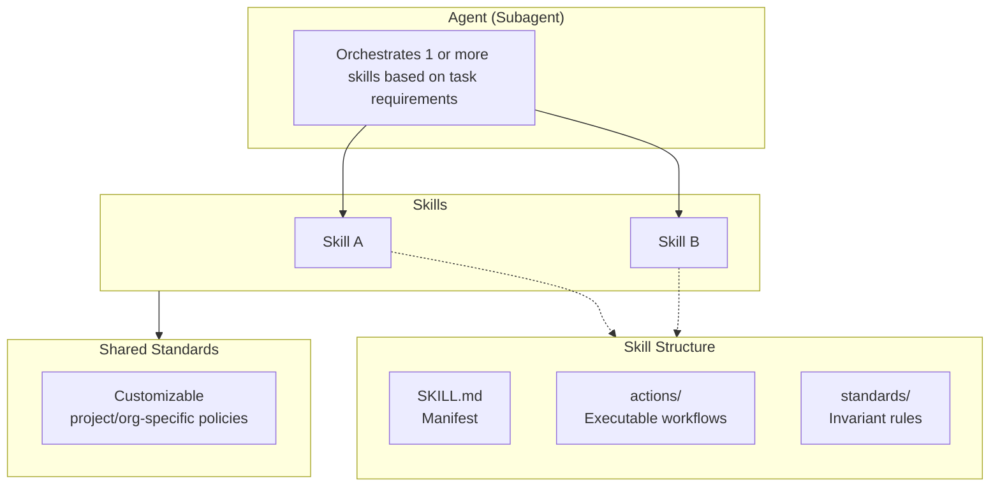

# AI Agent System

A portable, self-contained bundle of AI agents, skills, and standards that enables consistent AI-assisted engineering in any repository.

## Why Use This?

- **Portability** — Copy the `agent-system/` folder into any repository to enable AI-assisted development
- **Standardisation** — Codified best practices ensure consistent quality across all AI-assisted work
- **Specialisation** — Domain-specific agents provide deep expertise with isolated context for optimal token usage
- **Self-improving** — The repository uses its own agent-system to build and improve itself

## Architecture

The system uses a three-layer architecture where agents route to skills, which bundle actions and standards:



### Layer Responsibilities

| Layer | Location | Purpose |
|-------|----------|---------|
| **Agents** | `agents/*.md` | Thin routers that orchestrate 1+ skills based on task requirements |
| **Skills** | `skills/<domain>/` | Self-contained capability packages with actions and invariant standards |
| **Standards** | `standards/` | Customizable project/org-specific policies |

## Getting Started

### Adopting in Your Repository

1. **Copy the agent-system folder** to your repository:

   ```bash
   cp -r agent-system/ /path/to/your-repo/
   ```

2. **Create a root `AGENTS.md`** that points to the agent-system:

   ```markdown
   # Your Repository

   ## AI-Assisted Development

   This repository uses the agent-system for AI-assisted engineering.

   **→ See [`agent-system/AGENTS.md`](agent-system/AGENTS.md) for agent routing, skills, and standards.**
   ```

3. **Customise policy standards** in `standards/` to match your organisation's conventions (e.g., allowed commit types, branch naming patterns).

4. **Keep skill-bundled standards unchanged** — these define invariant processes that ensure consistency.

### Using an Agent

When working with an AI assistant, reference the appropriate agent for your task:

| Task | Agent | Example Prompt |
|------|-------|----------------|
| Create/review devcontainer | DevContainer-Expert | "Review my devcontainer configuration" |
| Commit changes | Git-Workflow-Expert | "Help me commit these changes" |
| Create a branch | Git-Workflow-Expert | "Create a feature branch for user auth" |
| Create a pull request | Git-Workflow-Expert | "Create a PR for my changes" |
| Document a decision | Decision-Record-Expert | "Create a decision record for choosing PostgreSQL" |

## Self-Improvement Model

This repository practices what it preaches — it uses its own agent-system to build and improve itself.

```
project/
├── learnings.md              # Institutional knowledge and patterns
└── future-enhancement-ideas.md   # Enhancement backlog with prioritised ideas
```

### Institutional Knowledge

The `project/` folder enables continuous improvement:

| File | Purpose | When to Use |
|------|---------|-------------|
| `learnings.md` | Captures patterns, insights, and architectural decisions | **Consult** before making decisions; **Update** after significant work |
| `future-enhancement-ideas.md` | Tracks enhancement ideas with unique IDs (e.g., `GW001`) | **Consult** when planning; **Update** when ideas surface beyond current scope |

This creates a feedback loop where working on the agent-system reveals improvements that get captured and fed back into future development.

## Quick Reference

### Available Agents

| Agent | Skill | Capabilities |
|-------|-------|--------------|
| DevContainer-Expert | `skills/devcontainer/` | create, review |
| Git-Workflow-Expert | `skills/git-workflow/` | create-branch, commit, create-pull-request |
| Decision-Record-Expert | `skills/decision-records/` | create, review |

### Git Workflow Standards

Consistent version control practices:

- **Branching** — Naming conventions and lifecycle management
- **Commits** — Conventional commits with structured messages
- **Pull Requests** — Templates and review checklists

### Language Standards

The system includes standards for:

- **Python** — uv, Ruff, strict typing
- **TypeScript** — ESLint, Prettier, pnpm
- **Bash** — ShellCheck, shfmt

### Key Files

| File | Description |
|------|-------------|
| [`agent-system/AGENTS.md`](agent-system/AGENTS.md) | Main routing table and skill references |
| [`agent-system/standards/standards.index.md`](agent-system/standards/standards.index.md) | Index of all shared standards |
| [`project/learnings.md`](project/learnings.md) | Institutional knowledge |
| [`project/future-enhancement-ideas.md`](project/future-enhancement-ideas.md) | Enhancement backlog |

